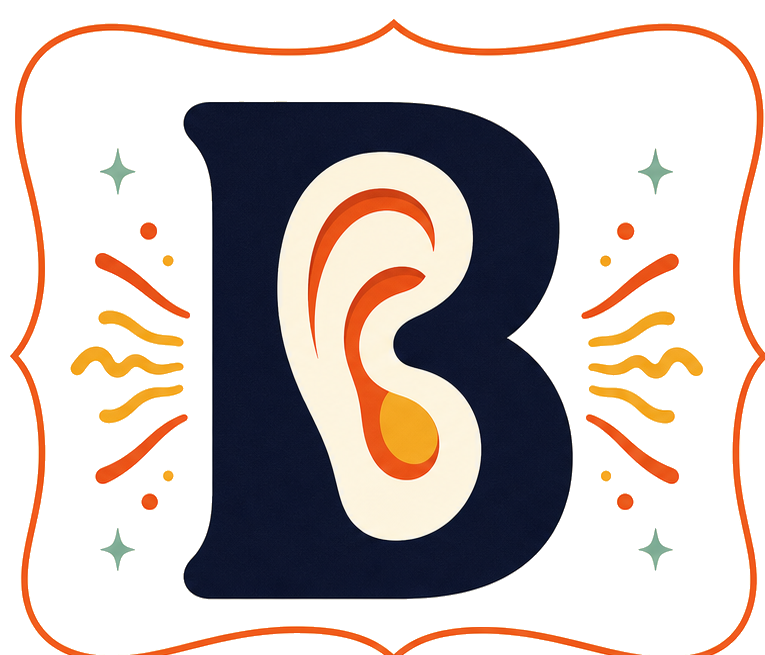
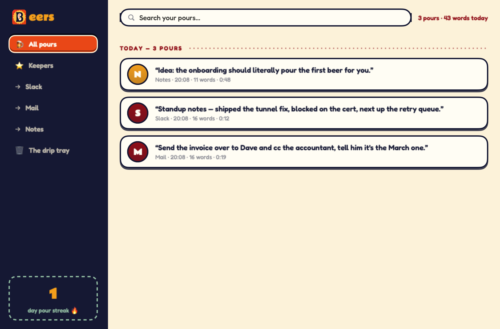
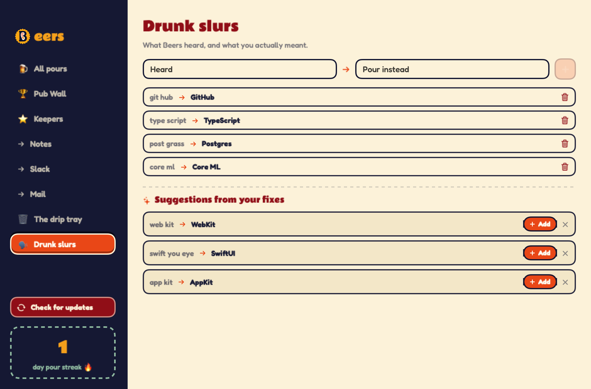
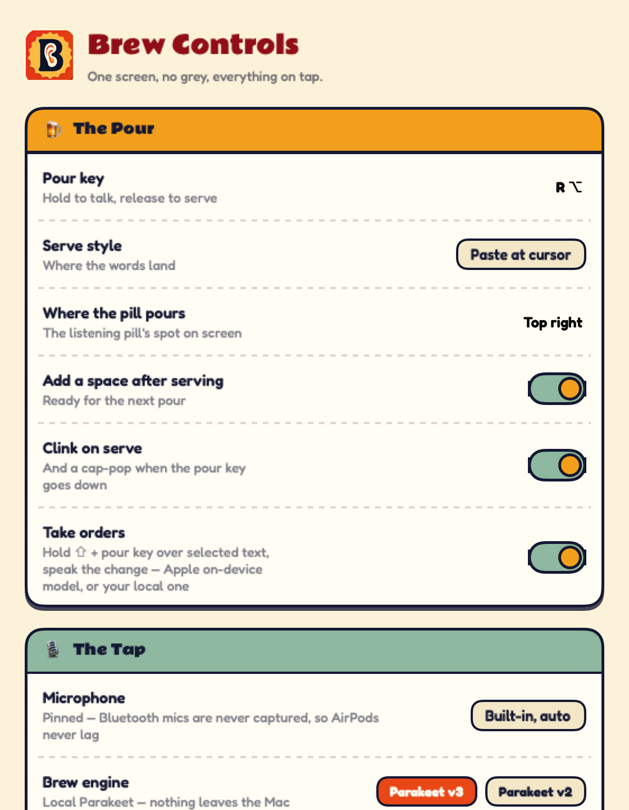
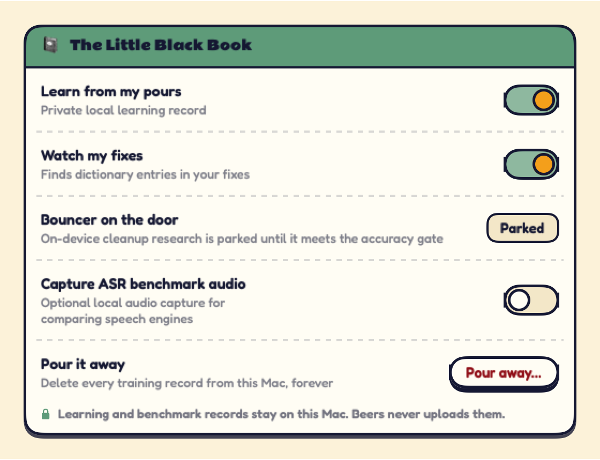
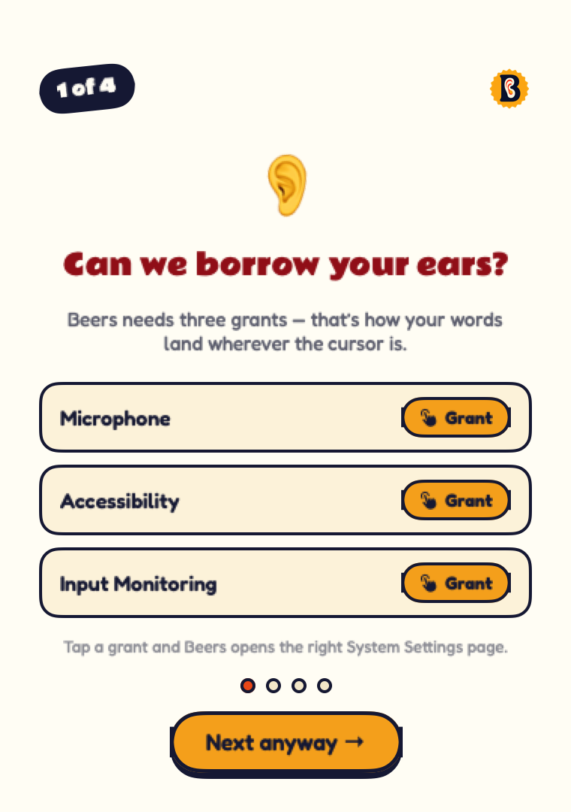
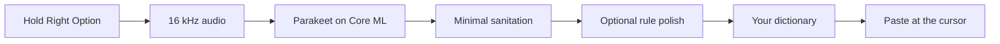

<div align="center">
  

  <h1>Push-to-talk dictation for macOS</h1>

  <p>
    Hold a key. Speak. Release. Your words land at the cursor.<br>
    Fast, private and open source — every line of it, under Apache-2.0.
  </p>

  <p>
    <a href="https://github.com/llatser-dot/beers/releases/latest"><strong>Download Beers</strong></a>
    ·
    <a href="https://llatser-dot.github.io/beers/">Website</a>
    ·
    <a href="#build-from-source">Build from source</a>
  </p>

  <p>
    <a href="https://github.com/llatser-dot/beers/releases/latest"></a>
    <a href="https://github.com/llatser-dot/beers/actions/workflows/release-readiness.yml"></a>
    
    
    <a href="LICENSE"></a>
  </p>
</div>



Beers is a native menu-bar app for Apple silicon Macs. It runs
[Parakeet](https://github.com/FluidInference/FluidAudio) locally through Core ML,
then pastes the result into whichever app you are using. A dictation is a
**pour**; every 1,000 words **pulls a pint**.

## Install

1. Download `Beers-<version>.app.zip` from the
   [latest release](https://github.com/llatser-dot/beers/releases/latest).
2. Unzip it and drag **Beers.app** into **Applications**.
3. Open Beers, grant Microphone, Input Monitoring and Accessibility, then hold
   **Right Option** to talk.

Published builds are Developer ID signed, Apple-notarised and Sparkle-signed.
Beers checks for updates from the signed [`appcast.xml`](appcast.xml).

**Requirements:** Apple silicon and macOS 14 Sonoma or later.

## What makes it different

- **Local speech recognition.** Audio is transcribed on your Mac. Ordinary pours
  have no server call and no API key.
- **The shortest trustworthy path.** Parakeet → minimal transcript sanitation →
  optional legacy rule polish → your dictionary → paste.
- **Learns the words that matter.** Drunk Slurs turns repeated keyboard
  corrections into one-tap dictionary suggestions.
- **Works wherever the cursor works.** Mail, Messages, Notes, browsers, editors,
  terminals and most native Mac apps.
- **Useful history without a data account.** The Taproom keeps searchable pours,
  Keepers, app filters and streaks locally.
- **Optional on-device commands.** On supported Macs, Shift + pour key can apply
  a spoken edit to selected text using Apple’s system-managed on-device model.
- **A personality, not another grey settings panel.** Beers counts words, pulls
  pints and can opt into the public Pub Wall without turning dictation into a
  social account.

## Inside Beers

<table>
  <tr>
    <td width="50%">
      
      <br><strong>Drunk Slurs</strong><br>
      Teach Beers what it heard and what you meant.
    </td>
    <td width="50%">
      
      <br><strong>Brew Settings</strong><br>
      Hotkey, microphone, engine, paste behaviour and local learning controls.
    </td>
  </tr>
  <tr>
    <td width="50%">
      
      <br><strong>The Little Black Book</strong><br>
      Local learning is visible, optional and deletable.
    </td>
    <td width="50%">
      
      <br><strong>First Round</strong><br>
      A guided, plain-English permissions setup.
    </td>
  </tr>
</table>

Every image above comes from the real SwiftUI views through the repository’s
off-screen snapshot harness. It uses synthetic, in-memory data and never reads
the maintainer’s pour history or personal dictionary.

## How a pour moves



Parakeet v3 is the default multilingual engine; v2 remains available for
English. The optional legacy rule polish is user-controlled and currently
enabled in the standard new-install profile. There is no production Ollama or
remote rewrite path.

## Privacy

Beers is deliberately explicit about its boundaries:

- Microphone audio is used for local transcription and is not uploaded.
- Pour history, local learning records and keyboard corrections stay under
  `~/Library/Application Support/Beers/`.
- ASR benchmark audio capture is separate, local-only and **off by default**.
- The app has no telemetry and no remote transcript-rewrite endpoint.
- The optional Pub Wall sends a public handle and aggregate word/pour counts.
  It never receives transcripts or audio; its complete boundary is documented in
  [`pubwall/README.md`](pubwall/README.md).
- The separate reference retraining loop under `ml/standing-loop/` is not
  installed or run by the app. If an operator chooses to run it, its own
  documentation makes the external model boundary explicit.

Use **Pour it away** to remove local learning and benchmark records. Use
**Smash the glasses** to clear Taproom history.

## Build from source

You need full Xcode, [XcodeGen](https://github.com/yonaskolb/XcodeGen) and
[Git LFS](https://git-lfs.com/).

```sh
brew install xcodegen git-lfs
git lfs install
git clone https://github.com/llatser-dot/beers.git
cd beers
git lfs pull
BEERS_ALLOW_LOCAL_SIGNING=1 ./install.sh
```

The installer generates the Xcode project from [`project.yml`](project.yml),
builds the app and uses a stable local signing identity so macOS privacy grants
survive rebuilds. Maintainers with Developer ID configured can set
`BEERS_TEAM_ID`.

Run the same non-installing readiness gate used by CI:

```sh
./scripts/release-check.sh
```

## Project map

| Area | Purpose |
|---|---|
| [`Beers/`](Beers/) | Swift, SwiftUI and Core ML macOS app |
| [`project.yml`](project.yml) | XcodeGen source of truth |
| [`ml/`](ml/) | Bouncer research, evaluation and Core ML export |
| [`pubwall/`](pubwall/) | Optional aggregate leaderboard worker |
| [`web/`](web/) + [`index.html`](index.html) | GitHub Pages site |
| [`docs/PROJECT.md`](docs/PROJECT.md) | Canonical architecture and current engineering status |
| [`docs/RELEASING.md`](docs/RELEASING.md) | Signed, notarised release procedure |

The experimental Bouncer deletion model is intentionally parked: its real-speech
precision did not meet the 0.98 ship gate, so it does not run in the production
dictation path. The research contract and results live in
[`ml/DESIGN.md`](ml/DESIGN.md).

## Contributing

Issues and focused pull requests are welcome. Start with
[`CONTRIBUTING.md`](CONTRIBUTING.md) for the build, test and privacy rules. If
you believe you have found a security or privacy issue, use
[GitHub’s private vulnerability reporting](https://github.com/llatser-dot/beers/security/advisories/new)
instead of opening a public issue.

## Uninstall completely

Remove:

- `/Applications/Beers.app`
- `~/Library/Application Support/Beers/`
- `~/Library/Application Support/FluidAudio/Models/`
- Beers from **System Settings → General → Login Items**, if enabled
- Beers grants from **System Settings → Privacy & Security**
- preferences with `defaults delete com.llatser.listen`

The bundle identifier predates the Beers name and is intentionally frozen
because macOS attaches privacy grants and saved settings to it.

## Licence

Beers is released under the [Apache License 2.0](LICENSE). Use it, modify it,
fork it, ship it commercially — the licence asks only that you keep the
copyright and licence notices and state what you changed. Third-party licences
and model notices are listed in [`THIRD_PARTY_NOTICES.md`](THIRD_PARTY_NOTICES.md).
